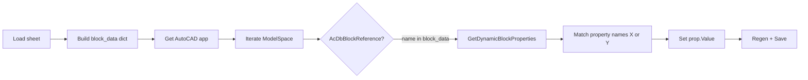

# Function_Ref — Workflow Breakdown

This folder contains two Python scripts that bridge **Microsoft Excel** and **AutoCAD**. They serve different purposes: one automates a **tower parking proposal** (block stacking, labels, tables), the other **pushes numeric parameters** from a dedicated sheet into **dynamic blocks** already placed in the drawing.

---

## Overview

| File | Role | AutoCAD API | Primary Excel source |
|------|------|-------------|----------------------|
| `auto_parking_proposal.py` | Full parking-stack workflow: read levels/slots, insert blocks, placeholders, labels, dimensions, optional I/J commands, update `AcDbTable` | `pyautocad` (`Autocad`, `APoint`) | `level_data.xlsm` (active sheet + optional `OUTPUT`) |
| `update_blocks_from_dynamic_sheet.py` | One-way sync: cell values → dynamic block properties (X/Y) for named blocks | `win32com` (`AutoCAD.Application`) | Sheet `DYNAMIC BLOCK PARMATER` (hardcoded path in script) |

---

## 1. `auto_parking_proposal.py`

### Purpose

Drive an AutoCAD **tower parking** layout from Excel: ground block, stacked SUV and sedan blocks (with optional per-type slot heights), machine room, parking blocks on placeholders, floor labels, total-height dimension, parameter table refresh, and optional **command rows** in Excel columns I/J.

### Excel layout (documented in the file)

| Region | Columns | Use |
|--------|---------|-----|
| Main parameters | B / C | Parameter name → value; drives levels, slots, and AutoCAD table text |
| Manual overrides | F / G | Overrides for `SEDAN_LEVEL` and `SUV_LEVEL` |
| Optional commands | I / J | Named commands (`TITLE_TEXT`, `NOTE_TEXT`, `LABEL_TEXT_HEIGHT`, `DIMENSION_OFFSET_X`, …) with values |
| Optional | Sheet `OUTPUT` | If present and `read_levels_from_excel(..., use_output_sheet=True)`, merges numeric level data from columns B/C of that sheet |

Default workbook path in code: `level_data.xlsm` (relative to the working directory when the script runs).

### Functional sections (in file order)

1. **Excel readers** — `get_all_excel_params`, `read_levels_from_excel`, `get_excel_table_data`, `get_excel_commands`
2. **Block insertion** — `insert_blocks(levels, acad)` — inserts `GROUND_LEVEL_BLOCK`, `SUV_BLOCK`, `SEDAN_BLOCK`, `MACHINE_ROOM_BLOCK` along Y; applies Y-scale from `SUV_SLOT` / `SEDAN_SLOT` vs block heights; special case when only SUVs (no sedans) for machine room Y
3. **Placeholders** — `place_parking_blocks_on_placeholders` — for each `PLACE_HOLDER` block ref, inserts `PARKING_BLOCK` at same insertion point with fixed X scale (7000/6700)
4. **Annotation** — `add_floor_labels_and_dimension` — text + short lines for floors; aligned dimension for total height; respects `_LABEL_TEXT_HEIGHT` and `_DIMENSION_OFFSET_X` when set via commands
5. **Table** — `update_acad_table` — finds first `AcDbTable` in the drawing and fills rows from Excel B/C pairs
6. **Extensible commands** — `COMMAND_HANDLERS` + `run_excel_commands` — runs handlers that may mutate a shared `params` dict (e.g. label height) before labels/dimension run

### End-to-end workflow (when the script is executed)

The file defines **`if __name__ == "__main__"` twice**; in Python only the **last** block runs. The effective entry point is the **second** main block, which runs the full pipeline:

1. Load all params, levels, table rows, and I/J commands from Excel.
2. Connect with `Autocad(create_if_not_exists=True)`.
3. Insert the vertical stack of blocks.
4. Replace each `PLACE_HOLDER` with a scaled `PARKING_BLOCK`.
5. Execute optional I/J commands (title, notes, style overrides).
6. Add floor labels and total height dimension.
7. Update the first AutoCAD table found to match Excel B/C.

### Dependencies

- `openpyxl` — read `.xlsm` / `.xlsx`
- `pyautocad` — COM bridge styled API; AutoCAD must be available

### Blocks and constants (high level)

- Block names: `SUV_BLOCK`, `SEDAN_BLOCK`, `GROUND_LEVEL_BLOCK`, `MACHINE_ROOM_BLOCK`, `PLACE_HOLDER`, `PARKING_BLOCK`
- Spacing defaults: SUV 2100 mm, Sedan 1800 mm; ground height and block heights used for Y stacking and scaling

---

## 2. `update_blocks_from_dynamic_sheet.py`

### Purpose

Read **fixed cells** on a single sheet and push **X and/or Y** values into **dynamic block properties** for specific block definitions found in **model space**. Then **regenerate** and **save** the active document.

### Excel layout

- **File**: hardcoded as  
  `C:\Users\Nextkraft\Documents\cad command by excel\level_data.xlsm`  
  (edit this path for your machine.)
- **Sheet**: `DYNAMIC BLOCK PARMATER` (spelling as in the script)
- **Cells**: `get_val` reads numeric values from cells such as C5, D5, C6, D7, C8, D8, C9, D9; `None` if empty or non-numeric

### Block → parameter mapping

| Block name | X source | Y source |
|------------|----------|----------|
| `PALLET_DYN_BLOCK` | C5 | D5 |
| `COUNTER_WEIGHT_DYN_BLOCK` | C6 | — |
| `TRANSPORTER_DYN_BLOCK` | — | D7 |
| `RCC_BRACKET_DYN_BLOCK` | C8 | — |
| `RCC_DYN_BLOCK` | C9 | D9 |

### End-to-end workflow

1. Open workbook with `data_only=True` and select the named sheet.
2. Build `block_data` with per-block `X` / `Y` (either can be `None`).
3. Attach to running AutoCAD via `GetActiveObject`, or start a new instance with `Dispatch`.
4. For each entity in `ModelSpace`, if it is a block reference whose **effective name** is in `block_data`:
   - Read dynamic properties.
   - For each property, if the name matches **X-like** (`X`, `DISTANCE1`, `WIDTH`) or **Y-like** (`Y`, `DISTANCE2`, `LENGTH`) and the corresponding value in `block_data` is not `None`, assign `prop.Value`.
5. `Regen(1)`, `Save()`; on failure, user is told to save manually.

### Dependencies

- `openpyxl`
- `pywin32` (`win32com.client`)

### Notes

- **Skipped** in the printed count refers to block references **not** in the `block_data` keys (not “errors”), so the skip count can be large in busy drawings.
- Property names must match the script’s allowed aliases; blocks whose dynamic parameters use different names will not update unless the script is extended.

---

## How the two scripts relate

- **Same domain** (parking/CAD automation from Excel) but **different jobs**:
  - `auto_parking_proposal.py` **creates and annotates** a proposal (blocks, text, table) from a **parameter table + commands** layout.
  - `update_blocks_from_dynamic_sheet.py` **only updates existing dynamic block instances** from a **fixed-cell** sheet; it does not insert blocks or touch tables/labels.
- They can use the **same workbook file** (`level_data.xlsm`) if that file contains both the parking data and the `DYNAMIC BLOCK PARMATER` sheet; paths must be aligned (`auto_parking_proposal` uses a **relative** default; the dynamic-block script uses an **absolute** path).
- **AutoCAD APIs differ** (`pyautocad` vs `win32com`); running both in one session is fine as long as AutoCAD is running and the correct DWG is active for the dynamic-block updater.

---

## Suggested run order (if both apply to one project)

1. Run **`auto_parking_proposal.py`** to build or refresh the proposal geometry and table (with Excel and DWG paths configured).
2. Open or keep the same drawing and run **`update_blocks_from_dynamic_sheet.py`** after editing the dynamic-parameter sheet, to sync pallet/counterweight/transporter/RCC-type blocks.

Adjust paths and sheet names in each script to match your deployment.
